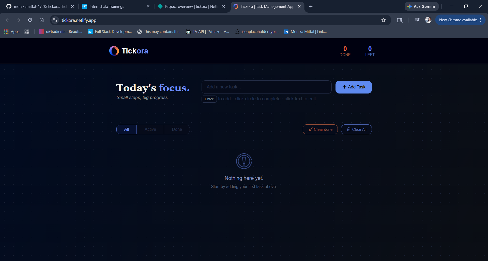
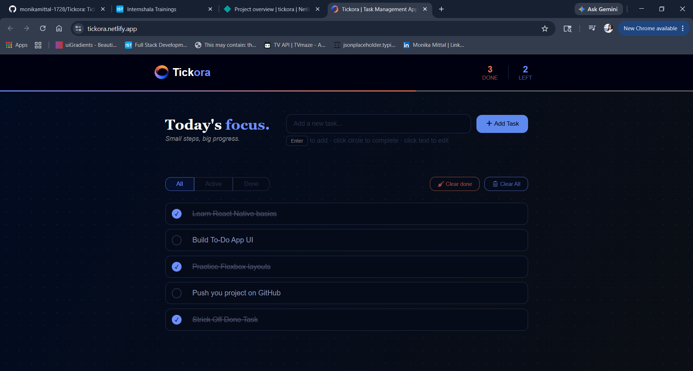
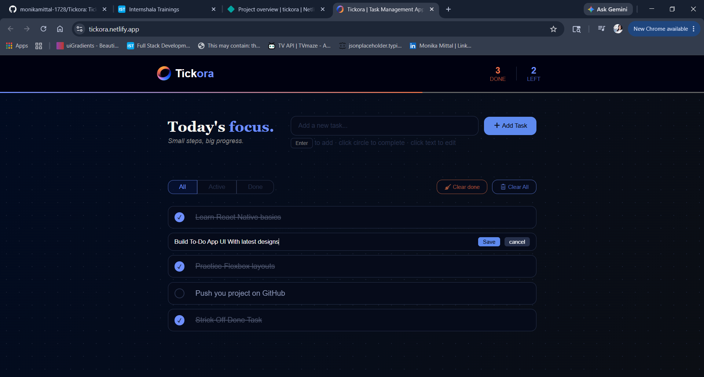
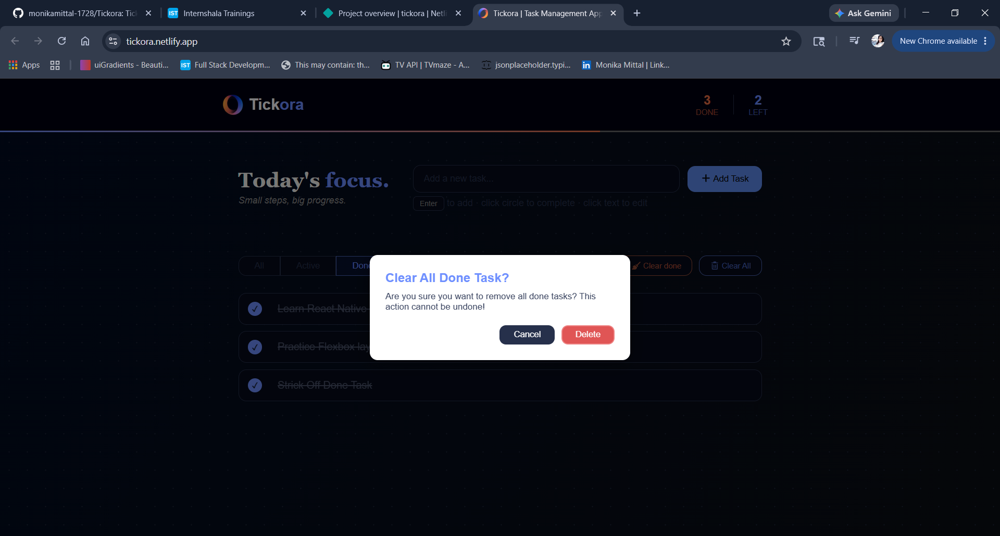
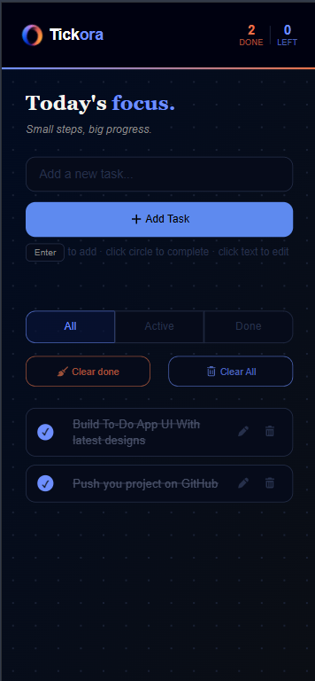

# Tickora — Task Management App

> *Small steps, big progress.*

Tickora is a minimal, focused task management app built with React. It helps you organize your day with a clean dark UI, smooth interactions, and zero clutter.

**Live Demo → [tickora.netlify.app](https://tickora.netlify.app)**

---

## Preview



---

## Features

- **Add tasks** via button click or `Enter` key
- **Complete tasks** with a satisfying circular checkbox
- **Inline editing** — click the edit icon to update any task in place; `Enter` to save, `Escape` to cancel
- **Delete with confirmation** — prevent accidental removal with a confirm dialog
- **Filter view** — switch between All, Active, and Done tasks
- **Clear done / Clear all** — bulk actions with confirmation prompts
- **Progress bar** — live gradient bar in the header showing completion percentage
- **Done / Left counter** in the header at a glance
- **Toast notifications** — brief feedback for every action
- **Persisted data** — tasks are saved to `localStorage` and survive page refresh
- **Fully responsive** — works great on mobile and desktop

---

## Screenshots

### Adding a Task


### Editing a Task


### Clear Done Tasks


### Mobile View


---

## Tech Stack

| Tool | Purpose |
|---|---|
| React 19 | UI & state management |
| Vite 7 | Build tool & dev server |
| Font Awesome | Icons |
| CSS Variables | Theming & design tokens |
| localStorage | Client-side persistence |

---

## Project Structure

```
Tickora/
├── public/
│   ├── logo.png          # App logo (used in header)
│   └── empty.png         # Empty state illustration
├── screenshots/
│   ├── initial-state.png
│   ├── adding-task.png
│   ├── edit-state.png
│   ├── clear-done.png
│   └── mobile-view.png
├── src/
│   ├── components/
│   │   ├── Header.jsx    # Fixed header with logo, stats & progress bar
│   │   ├── ToDoList.jsx  # Filter tabs, clear buttons, task list
│   │   ├── ToDoItem.jsx  # Individual task with edit/delete
│   │   ├── AddTask.jsx   # Input field and add button
│   │   └── styles.css    # All component styles
│   ├── App.jsx           # Root component — state, handlers, dialog, toast
│   ├── App.css           # App layout, dialog & toast styles + CSS variables
│   ├── index.css         # Global reset & body background
│   └── main.jsx          # React entry point
├── package.json
└── vite.config.js
```

---

## Getting Started

### Prerequisites
- Node.js (v18 or higher)
- npm

### Installation

```bash
# Clone the repository
git clone https://github.com/monikamittal-1728/Tickora.git

# Navigate into the project
cd Tickora

# Install dependencies
npm install

# Start the development server
npm run dev
```

Open [http://localhost:5173](http://localhost:5173) in your browser.

---

## Keyboard Shortcuts

| Key | Action |
|---|---|
| `Enter` (in add field) | Add new task |
| `Enter` (in edit field) | Save edited task |
| `Escape` (in edit field) | Cancel edit |

---

## Design

- **Theme:** Deep dark navy with a dot-grid radial gradient background
- **Accent colors:** Blue (`#6e8fff`) for active/left tasks · Orange (`#e87248`) for done tasks
- **Fonts:** DM Serif Display (headings) · DM Sans (body)
- **Animations:** Rotating logo, animated progress bar on load, hover-reveal action buttons, smooth checkbox transitions

---

## Author

**Monika Gupta**
- GitHub: [@monikamittal-1728](https://github.com/monikamittal-1728)
- Live App: [tickora.netlify.app](https://tickora.netlify.app)

---

## License

This project is open source and available under the [MIT License](LICENSE).
